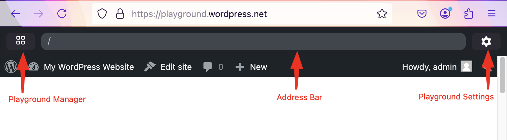
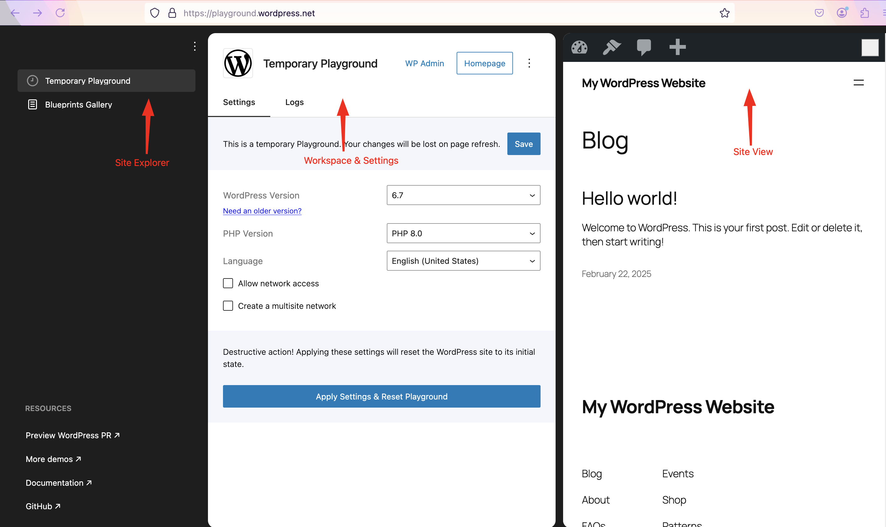
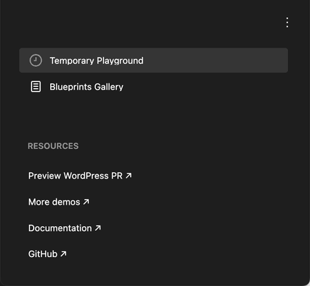
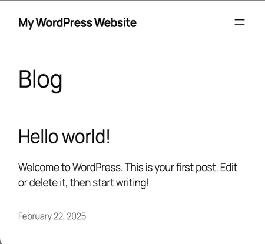
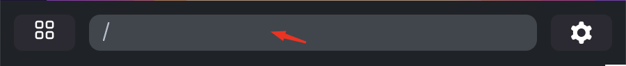

# WordPress Playground ウェブ インスタンス

<!--
# WordPress Playground web instance
-->

[https://playground.wordpress.net/](https://playground.wordpress.net/) は、開発者がサーバーを必要とせずにブラウザ上で WordPress を実行できる多機能ウェブツールです。この環境は、プラグイン、テーマ、その他の WordPress 機能を迅速かつ効率的にテストするのに特に便利です。

<!--
[https://playground.wordpress.net/](https://playground.wordpress.net/) is a versatile web tool that allows developers to run WordPress in a browser without needing a server. This environment is particularly useful for testing plugins, themes, and other WordPress features quickly and efficiently.
-->

主な機能:

<!--
Key features:
-->

-   **ブラウザベース**: ローカルサーバーのセットアップは不要です。
-   **インスタントセットアップ**: ワンクリックで WordPress を起動できます。
-   **テスト環境**: プラグインやテーマのテストに最適です。

<!--
-   **Browser-based**: No need for a local server setup.
-   **Instant Setup**: Run WordPress with a single click.
-   **Testing Environment**: Ideal for testing plugins and themes.
-->

[クエリパラメータ](/developers/apis/query-api/) を使用すると、Playground インスタンスを直接制御できます。WordPress や PHP のバージョン、インストールするプラグインやテーマなどの設定を指定したり、「 Blueprint 」と呼ばれる設定ファイルを参照したりできます。([こちら](/quick-start-guide#try-a-block-a-theme-or-a-plugin) でいくつかの例をご覧ください)。

<!--
Via [Query Params](/developers/apis/query-api/) you can directly control the Playground instance. You can assign settings, like WordPress or PHP versions, plugins and theme to install or point to a configuration file called "Blueprint". (check [here](/quick-start-guide#try-a-block-a-theme-or-a-plugin) some examples).
-->

Playground インターフェースは、次の 3 つの主要セクションで構成されています。

<!--
The Playground interface consists of three key sections:
-->

-   **サイトエクスプローラー**

-   **ワークスペースと設定**

-   **サイトプレビュー**

-   **アドレスバー**

<!--
-   **Site Explorer**

-   **Workspace & Settings**

-   **Site Preview**

-   **Address Bar**
-->

**Playground Manager** アイコンをクリックすると、下のスクリーンショットに示すように次のインターフェースが表示されます。

<!--
Upon clicking the **Playground Manager** icon you can view the following interface as shown in the screenshot below.
-->

これらの各セクションは、WordPress インスタンスを管理するための重要な機能を提供します。

<!--
Each of these sections provides essential functionalities for managing the WordPress instance.
-->

:::tip

WordPress インスタンスから [プラグイン](https://w.org/plugins) と [テーマ](https://w.org/themes) を参照できるようにするには、「ネットワーク アクセス」を有効にする必要があります。
:::

<!--
:::tip

You need to activate "Network access" to be able to browse for [plugins](https://w.org/plugins) and [themes](https://w.org/themes) from your WordPress instance.
:::
-->

#

## 1. サイトエクスプローラー

<!--
## 1. Site Explorer
-->

**サイトエクスプローラ**パネルでは、Playground ブラウザインスタンス全体を制御できます。以下のことが可能です。

<!--
The **Site Explorer** panel lets you control the overall Playground browser instance. It allows you to:
-->

-   Playground インスタンス内で複数の WordPress サイトを管理できます。

-   保存したサイトを切り替えたり、新しいインスタンスを作成したりできます。

-   4 つの主要なリソースリンクにアクセスできます。

    -   [WordPress PR のプレビュー](https://playground.wordpress.net)
    -   [その他のデモ](https://playground.wordpress.net/demos/index.html)
    -   [ドキュメント](https://wordpress.github.io/wordpress-playground/)
    -   [GitHub](https://github.com/wordpress/wordpress-playground)

-   その他のオプションについては、3 点メニューをご利用ください。

    -   WordPress PR のプレビュー
    -   Gutenberg PR のプレビュー
    -   GitHub からのインポート
    -   Zip からのインポート

<!--
-   Manage multiple WordPress sites within the Playground instance.

-   Switch between saved sites and create new instances.

-   Access four key resource links:

    -   [Preview WordPress PR](https://playground.wordpress.net)
    -   [More demos](https://playground.wordpress.net/demos/index.html)
    -   [Documentation](https://wordpress.github.io/wordpress-playground/)
    -   [GitHub](https://github.com/wordpress/wordpress-playground)

-   Utilize the three-dot menu for additional options:

    -   Preview WordPress PR
    -   Preview Gutenberg PR
    -   Import from GitHub
    -   Import from Zip
-->

## 2. ワークスペースと設定

<!--
## 2. Workspace & Settings
-->

**ワークスペースと設定** には現在選択されているサイトが表示されます。サイトが 1 つしかない場合は、デフォルトで **一時プレイグラウンド** が表示されます。複数のサイトが保存されている場合は、**サイトエクスプローラー** で選択したサイトに基づいてこのセクションの内容が更新されます。

<!--
The **Workspace & Settings** displays the currently selected site. If you only have one site, it defaults to the **Temporary Playground**. If multiple sites are saved, this section updates based on the selected site from the **Site Explorer**.
-->

ここで表示される設定はアクティブなサイトにのみ適用され、Playground 全体の設定ではありません。以下のオプションがあります。

<!--
The settings displayed here apply only to the active site and are not global Playground settings. The options include:
-->

-   **WordPress バージョン:** 最新の安定版、リリース候補版 (RC)、および旧バージョンから選択します。

-   **PHP バージョン:** 互換性テスト用の PHP バージョンを選択します。

-   **言語:** WordPress のインターフェース言語を設定します。

-   **ネットワークアクセス:** サイトへのインターネットアクセスを有効または無効にします。

-   **マルチサイトネットワーク:** マルチサイト機能を有効にして、ネットワーク化されたサイトをテストします。

<!--
-   **WordPress Version:** Choose from the latest stable version, release candidates (RC), and older versions.

-   **PHP Version:** Select the PHP version for compatibility testing.

-   **Language:** Set the WordPress interface language.

-   **Network Access:** Enable or disable internet access for the site.

-   **Multisite Network:** Activate the multisite functionality to test networked sites.
-->

### 一時的な Playground コンテキスト

<!--
### Temporary Playground Context
-->

-   Playground の最初のサイトは、デフォルトで常に「一時 Playground 」と呼ばれます。

-   追加のサイトが作成されると、選択されたサイトに応じて UI 名が変更されます。

-   **一時 Playground ** で行った変更は、ページを更新すると失われます。

-   その他の機能:

    -   **GitHub にエクスポート:** Playground の現在の状態を GitHub リポジトリに保存します。

    -   **サイトを .zip としてダウンロード:** WordPress インスタンスを zip ファイルとしてエクスポートします。

    -   **ブループリントを表示:** Playground の設定詳細を確認します。

    -   **エラーを報告:** 問題が発生した場合は、問題を送信してください。

<!--
-   The first site in the Playground is always called the Temporary Playground by default.

-   When additional sites are created, the UI name changes according to the selected site.

-   Changes made in the **Temporary Playground** are lost upon page refresh.

-   Additional functionalities include:

    -   **Export to GitHub:** Save the current state of the Playground to a GitHub repository.

    -   **Download Site as .zip:** Export the WordPress instance as a zip file.

    -   **View Blueprint:** Check the configuration details of the Playground setup.

    -   **Report Error:** Submit an issue if something goes wrong.
-->

## 3. サイトのプレビュー

<!--
## 3. Site Preview
-->

**サイトプレビュー**は、現在アクティブな WordPress インスタンスを全画面で表示する機能です。ユーザーは WordPress の設定をリアルタイムで操作できます。

<!--
The **Site Preview** is a full-screen display of the currently active WordPress instance. It allows users to interact with their WordPress setup in real-time.
-->

-   選択すると、ビューが自動的に全画面に拡大されます。

-   ユーザーは以下の方法で Playground の他のセクションに戻ることができます。

    -   **左側のアイコン** をクリックすると、**サイトエクスプローラー** に戻ります。

    -   **右側のアイコン** をクリックすると、**ワークスペースと設定** に戻ります。

<!--
-   The view automatically expands to full screen when selected.

-   Users can return to the other Playground sections using:

    -   The **left-side icon** to navigate back to the **Site Explorer**.

    -   The **right-side icon** to return to the **Workspace & Settings**.
-->

## 4. アドレスバー

<!--
## 4. Address Bar
-->

**アドレスバー**には、Playground で現在実行中の WordPress インスタンスの URL が表示されます。ユーザーはここから以下の操作を行うことができます。

<!--
The **Address Bar** displays the URL of the current WordPress instance running in Playground. It allows users to:
-->

-   インスタンスの URL をコピーして共有します。

-   高度なデバッグのためにクエリパラメータを変更します。

-   インスタンスをデフォルトの状態にリセットします。

<!--
-   Copy and share the instance URL.

-   Modify query parameters for advanced debugging.

-   Reset the instance to its default state.
-->

:::caution

https://playground.wordpress.net のサイトはコミュニティをサポートするために存在しますが、トラフィックが大幅に増加した場合、引き続き機能するという保証はありません。

一定の可用性が必要な場合は、[独自の WordPress Playground をホスト](/developers/architecture/host-your-own-playground) する必要があります。
:::

<!--
:::caution

The site at https://playground.wordpress.net is there to support the community, but there are no guarantees it will continue to work if the traffic grows significantly.

If you need certain availability, you should [host your own WordPress Playground](/developers/architecture/host-your-own-playground).
:::
-->
