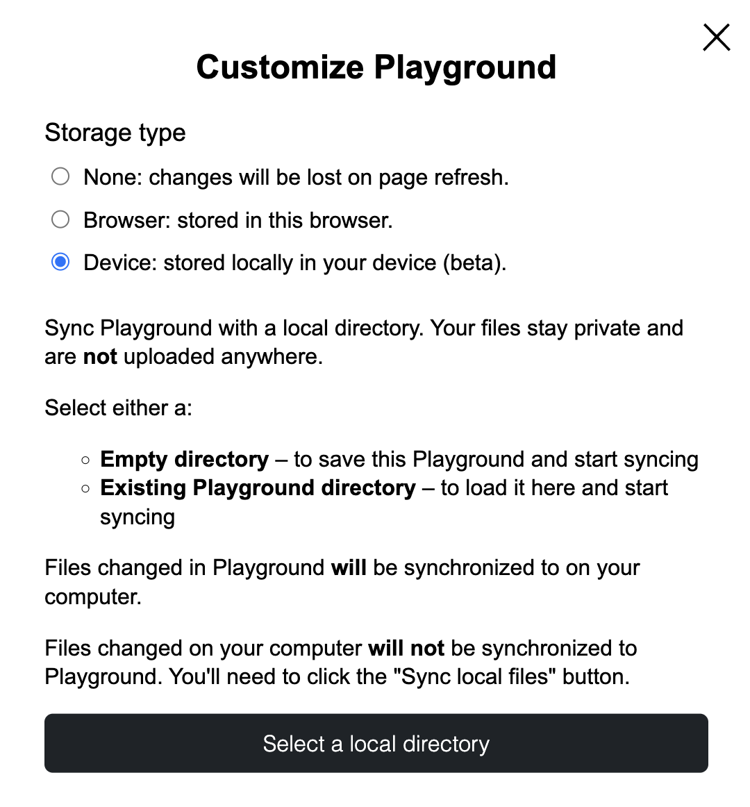

# Build

Makakatulong ang WordPress Playground upang mabilis kang makalikha at makapag-aral ng WordPress, kahit pa sa mobile na walang signal. Maaari mong gamitin ang Playground kung saan ka pinakamahusay na magtrabaho, maging ito man ay sa browser, Node.js, mobile apps, VS Code, o iba pa.

## Mabilis na Pag-set up ng Lokal na WordPress Environment

Maaari mong i-integrate nang seamless ang Playground sa iyong development workflow upang mabilis na ilunsad ang lokal na WordPress environment para sa pag-test ng iyong code. Magagawa mo ito nang direkta [mula sa terminal](/developers/local-development/wp-now) o sa [paborito mong IDE](/developers/local-development/vscode-extension).

## I-save ang Mga Pagbabago sa Isang Block Theme at Gumawa ng GitHub Pull Requests

Maaari mong ikonekta ang iyong Playground instance sa isang GitHub repository at lumikha ng Pull Request para sa mga pagbabagong ginawa mo sa pamamagitan ng WordPress UI, gamit ang [Create Block Theme](https://wordpress.org/plugins/create-block-theme/) plugin.

Sa workflow na ito, maaari kang bumuo ng block theme nang buo sa iyong browser at i-save ang iyong mga pagbabago sa GitHub, o pagandahin/ayusin ang isang umiiral na theme.

<iframe width="800" src="https://www.youtube.com/embed/94KnoFhQg1g" frameborder="0" allow="accelerometer; autoplay; clipboard-write; encrypted-media; gyroscope; picture-in-picture" allowfullscreen></iframe>

Narito ang ilan pang halimbawa ng workflow na ito:

-   [Developer Hours: Creating WordPress Playground Blueprints for Testing and Demos](https://www.youtube.com/watch?v=gKrij8V3nK0&t=2488s)
-   [Recap Hallway Hangout: Theme Building with Playground, Create-block-theme plugin, and GitHub](https://make.wordpress.org/core/2024/06/25/recap-hallway-hangout-theme-building-with-playground-create-block-theme-plugin-and-github/)

## Pag-synchronize ng Iyong Playground Instance sa Lokal na Folder at Paglikha ng GitHub Pull Requests

Sa Google Chrome, maaari mong i-synchronize ang iyong Playground instance sa isang lokal na directory, na maaaring:

-   Isang walang laman na directory – para i-save ang Playground at simulang mag-sync
-   Isang umiiral na directory – para i-load ito dito at simulang mag-sync

:::info

Ang tampok na ito ay available lamang sa Google Chrome sa ngayon. Hindi pa ito gumagana sa ibang browser.

:::

Tungkol sa mga pagbabagong ginawa sa magkabilang panig ng koneksyon:

-   Ang mga file na nabago sa Playground ay masi-sync sa iyong computer.
-   Ang mga file na nabago sa iyong computer ay **hindi** masi-sync pabalik sa Playground. Kailangan mong i-click ang button na "Sync local files."

Sa workflow na ito maaari kang direktang gumawa ng GitHub PR mula sa iyong mga pagbabagong ginawa sa lokal na directory.

Tingnan dito ang maikling demo ng workflow na ito sa aksyon:

<iframe width="800" src="https://www.youtube.com/embed/UYK88eZqrjo" frameborder="0" allow="accelerometer; autoplay; clipboard-write; encrypted-media; gyroscope; picture-in-picture" allowfullscreen></iframe>

## Integrasyon sa Iba Pang API para Gumawa ng Bagong Mga Tool

Maaari mong pagsamahin ang Playground sa iba't ibang API upang lumikha ng kahanga-hangang mga tool. Walang katapusang mga posibilidad.

Maaari mong [gamitin ang WordPress Playground sa Node.js](/developers/local-development/php-wasm-node) upang gumawa ng mga bagong tool. Ang [@php-wasm/node package](https://npmjs.org/@php-wasm/node), na nagdadala ng PHP WebAssembly runtime, ay ang package na ginagamit para sa [https://playground.wordpress.net/](https://playground.wordpress.net/), halimbawa.

Isa pang kawili-wiling app na ginawa sa ibabaw ng Playground ay ang **Translate Live** (tingnan ang [halimbawa](https://translate.wordpress.org/projects/wp-plugins/friends/dev/de/default/playground/)) na, sa kombinasyon ng Open AI, ay nagbibigay ng WordPress translations tool “in place” kung saan makikita at maayos ang mga pagsasalin sa kanilang totoong konteksto (tingnan ang halimbawa). Basahin pa tungkol sa tool na ito sa [Translate Live: Updates to the Translation Playground](https://make.wordpress.org/polyglots/2023/05/08/translate-live-updates-to-the-translation-playground/).

## Gumana Offline at Bilang Native App

Kapag unang binisita mo ang [playground.wordpress.net](https://playground.wordpress.net/), awtomatikong kino-cache ng iyong browser ang lahat ng kinakailangang file para magamit ang Playground. Mula noon, maaari mong i-access ang [playground.wordpress.net](https://playground.wordpress.net/), kahit walang internet connection, tinitiyak na maaari kang magpatuloy sa iyong proyekto nang hindi napuputol.

Maaari mo ring i-install ang Playground sa iyong device bilang Progressive Web App (PWA) upang ilunsad ang Playground nang direkta mula sa iyong home screen—parang native app lang.

Basahin ang [Introducing Offline Mode and PWA Support for WordPress Playground](https://make.wordpress.org/playground/2024/08/05/offline-mode-and-pwa-support/) para sa karagdagang impormasyon.

## I-embed ang WordPress Site sa Non-Web Environments

Ang gabay na [How to ship a real WordPress site in a native iOS app via Playground?](../guides/wordpress-native-ios-app) ay nagpapakita kung paano natin magagamit ang Playground upang i-wrap ang isang WordPress site sa isang iOS app.
