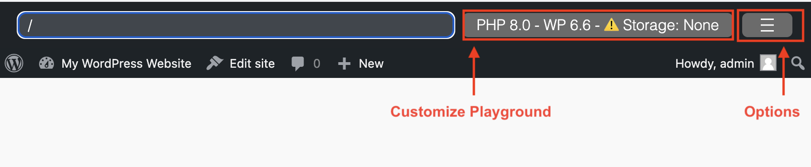
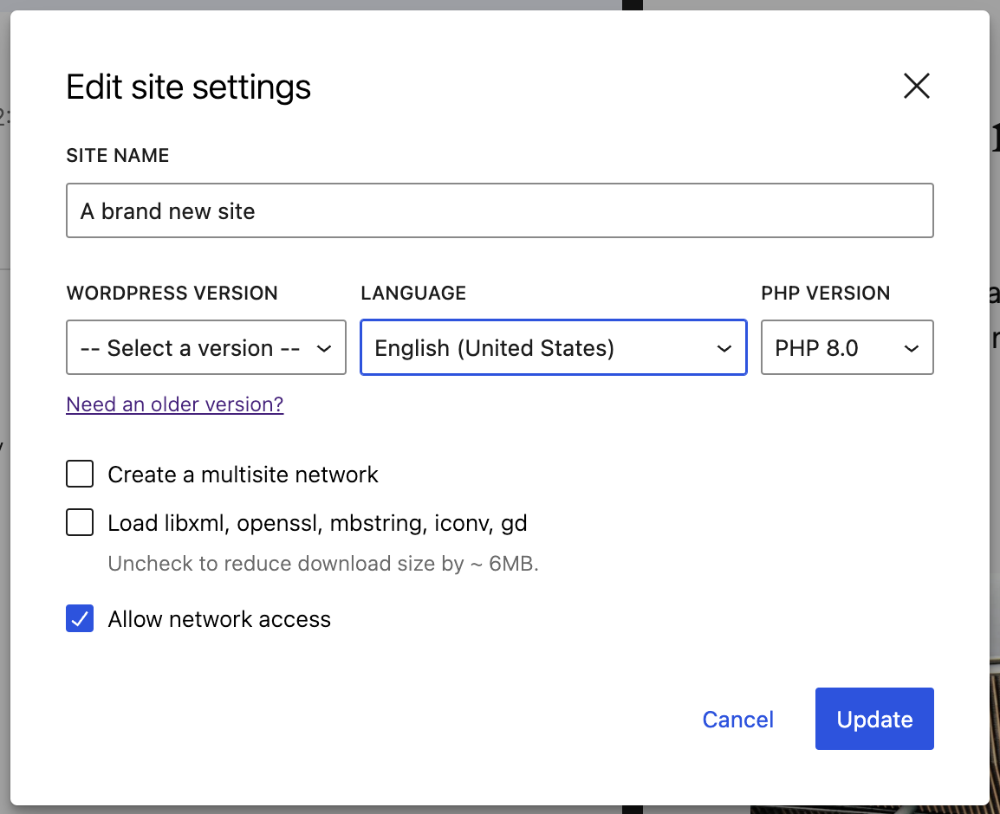
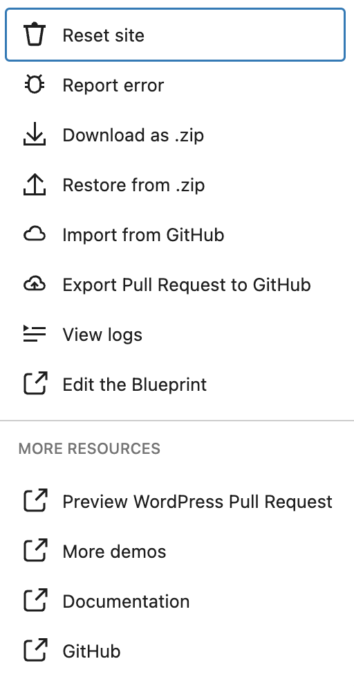

# Playground web instance ng WordPress

[https://playground.wordpress.net/](https://playground.wordpress.net/) ay isang versatile na web tool na nagpapahintulot sa mga developer na patakbuhin ang WordPress sa browser nang hindi nangangailangan ng server. Napakagamitin ito para sa mabilisang pagsusuri ng plugins, themes, at iba pang feature ng WordPress.

## Mga Pangunahing Tampok:

-   **Browser-based**: Hindi kailangan ng lokal na server setup.
-   **Instant Setup**: Patakbuhin ang WordPress nang isang click lang.
-   **Testing Environment**: Perpekto para sa pagsusuri ng plugins at themes.

Sa pamamagitan ng [Query Params](/developers/apis/query-api/) maaari mong direktang i-load sa Playground instance ang partikular na bersyon ng WordPress, theme, plugin, o mas kumplikadong setup gamit ang blueprints (tingnan ang [mga halimbawa](/quick-start-guide#try-a-block-a-theme-or-a-plugin)).

Mula sa Playground website, may ilang toolbars na nagagamit upang i-customize ang iyong Playground instance at magbigay ng mabilis na access sa ilang resources at utilities.

## I-customize ang Playground

Ang mga pagpipilian sa "Customize Playground" window ay tumutugma sa mga sumusunod na [Query API options](/developers/apis/query-api#available-options):

-   `php`
-   `php-extension-bundle`
-   `networking`
-   `wp`

:::tip

Kailangan mong i-activate ang "Network access" upang makapag-browse para sa [plugins](https://w.org/plugins) at [themes](https://w.org/themes) mula sa iyong WordPress instance.
:::

## Menu ng Playground Options

Ang menu na ito ay naglalaman ng mga link sa ilang resources at tools ng Playground:

-   **Reset Site**: Buburahin nito ang lahat ng data at ire-reload ang page na may bagong site.
-   **Report error**: Kung may isyu ka sa WP Playground, maaari mo itong i-report gamit ang form na makikita sa opsyong ito. Makakatulong kang lutasin ang mga problema sa pamamagitan ng pagbabahagi ng detalye ng error sa development team.
-   **Download as zip**: Gumagawa ito ng `.zip` ng setup ng Playground instance kasama ang anumang themes o plugins na naka-install. Hindi kasama sa `.zip` ang content at database changes.
-   **Restore from zip**: Pinapayagan kang muling likhain ang Playground instance gamit ang anumang `.zip` na ginawa sa pamamagitan ng "Download as zip".
-   **Import from GitHub**: Pinapayagan ka nitong mag-import ng plugins, themes, at wp-content directories direkta mula sa iyong public GitHub repositories. Upang magamit ito, ikonekta ang iyong GitHub account sa WordPress Playground.
-   **Export Pull Request to GitHub**: Pinapayagan ka nitong i-export ang WordPress plugins, themes, at buong wp-content directories bilang pull requests sa anumang public GitHub repository. Tingnan ang demo rito: https://www.youtube.com/watch?v=gKrij8V3nK0&t=2488s
-   **View Logs**: Dadalhin ka nito sa modal na nagpapakita ng anumang error logs para sa Playground, WordPress, at PHP.
-   **Edit the blueprint**: Bubuksan nito ang kasalukuyang blueprint na ginagamit ng Playground instance sa [Blueprints Builder tool](https://playground.wordpress.net/builder/builder.html). Mula rito, maaari mong i-edit ang blueprint online at patakbuhin muli ang Playground instance gamit ang iyong binagong blueprint.

:::caution

Ang site sa https://playground.wordpress.net ay para suportahan ang komunidad, ngunit walang garantiya na patuloy itong gagana kung lalobo ang traffic.

Kung kailangan mo ng tiyak na availability, dapat mong [i-host ang sarili mong WordPress Playground](/developers/architecture/host-your-own-playground).
:::
